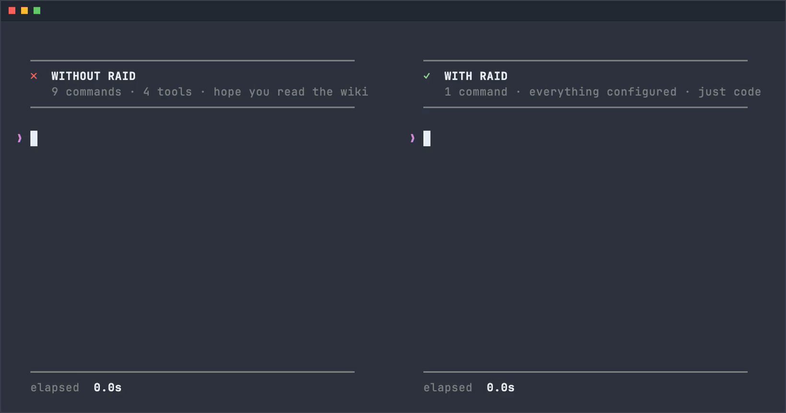

# Raid - Declarative development environment orchestrator

<p align="center">
<a href="https://github.com/8bitAlex/raid/actions/workflows/build.yml"></a>
<a href="https://codecov.io/github/8bitAlex/raid"></a>
<a href="https://goreportcard.com/report/github.com/8bitAlex/raid"></a>
<br>


<br>

</p>

<br/>
<p>
It's more than <i>just</i> a command runner.
<p>

<p align="center">

</p>

---

Every complex system has the same problem. There's a Confluence page from two years ago, a Slack thread with the "actual" way to start the proxy, a bash script that lives on one person's machine, and a handful of developers who've memorized what everyone else has to ask about. Running the test suite, patching a dependency, switching to staging, deploying a service — each one is a small excavation through wikis, READMEs, and tribal knowledge. It works until someone leaves, or until the script quietly breaks.

**Raid replaces all of it.** Define your team's commands, environments, and workflows as YAML that lives in the repository — versioned, shared, and executable. Anyone can run `raid test`, `raid patch`, or `raid deploy` correctly, consistently, without reading docs or asking another dev.

```bash
raid install    # clone all repos and set up the full environment
raid env local  # switch everything to local — all repos, all at once
raid test       # run the test suite — however this repo defines that
raid patch      # apply a patch — whatever that means for this service
```

The config commits with the code. When the process changes, the command changes with it — one place, not scattered across wikis, scripts, and memory.

📖 For the full design rationale, see the [design proposal](https://alexsalerno.dev/blog/raid-design-proposal).

---

## How it works

A **profile** (`*.raid.yaml`) describes your full system: which repos to clone, what environments exist, and what commands the team uses. It lives in a YAML file you register with raid once.

Each **repository** can commit its own `raid.yaml` at its root, defining the commands and environment config specific to that service. Raid merges these automatically when the profile loads.

When a developer runs any raid command, it executes against the right repo, in the right environment, with the right variables — no manual steps, no guessing.

---

## Key Features

- **Commands that live with the code** — `raid test`, `raid patch`, `raid proxy` — define once in YAML, run anywhere. No more tracking down scripts or asking how something works.
- **Consistent environments** — define local, staging, and production environments once. `raid env staging` applies the right variables and tasks across every repo in a single command.
- **Full system orchestration** — manage any number of repos as a single unit. Clone, configure, and run them together or individually.
- **Rich task runner** — 11 built-in task types: shell commands, scripts, HTTP downloads, git operations, health checks, template rendering, prompts, confirmations, and more.
- **Portable** — config is just YAML in the repo. Works on macOS, Linux, and Windows.

---

## Development Status

Raid is currently in the **prototype stage**. Core functionality is still being explored and iterated on — expect frequent changes and incomplete features.

Feedback, issues, and contributions are welcome as the project takes shape.

---

## Getting Started

### Installation

**macOS**
```bash
brew install 8bitalex/tap/raid
```

**Linux**
```bash
curl -fsSL https://raw.githubusercontent.com/8bitalex/raid/main/install.sh | bash
```

**Windows**

1. Go to the [latest release](https://github.com/8bitalex/raid/releases/latest) and download `raid_<version>_windows_amd64.zip`
2. Extract the zip — you'll find `raid.exe` inside
3. Move `raid.exe` to a folder that's on your `PATH` (e.g. `C:\Program Files\raid\`)
4. If you moved it to a new folder, add that folder to your `PATH`:
   - Open **Settings** → **System** → **About** → **Advanced system settings**
   - Click **Environment Variables** → select **Path** under System variables → **Edit** → **New**
   - Paste the folder path and click OK
5. Open a new terminal and verify: `raid --version`

### Quickstart

```bash
raid profile create   # interactive wizard: name your profile and add repositories
raid install          # clone repos and run install tasks
```

You can also write a profile file manually (see [Configuration](#configuration)) and register it with `raid profile add <file>`.

---

## Commands

### `raid profile`

Manage profiles. A profile is a named collection of repositories and environments.

- `raid profile create` — interactive wizard to create and register a new profile
- `raid profile add <file>` — register profiles from a YAML or JSON file
- `raid profile list` — list all registered profiles
- `raid profile <name>` — switch the active profile
- `raid profile remove <name>` — remove a profile

### `raid install`

Clone all repositories in the active profile and run any configured install tasks. Already-cloned repos are skipped.

- `raid install` — clone all repos and run install tasks
- `raid install <repo>` — clone and install a single named repository only (profile-level install tasks are not run)

Clones run concurrently. Use `-t` to cap the number of concurrent clone threads.

### `raid env`

- `raid env <name>` — apply a named environment: writes `.env` files into each repo and runs environment tasks
- `raid env` — show the currently active environment
- `raid env list` — list available environments

### `raid doctor`

Check the current configuration for issues and get suggestions for fixing them. Useful after initial setup or when something isn't working as expected.

### `raid <command>`

Run a custom command defined in the active profile or any of its repositories.

```bash
raid test         # run the "test" command
raid patch        # run the "patch" command
raid deploy       # run the "deploy" command
```

Arguments passed after the command name are available inside tasks as `$RAID_ARG_1`, `$RAID_ARG_2`, etc.

```bash
raid deploy staging v1.2.3   # $RAID_ARG_1=staging, $RAID_ARG_2=v1.2.3
```

Custom commands appear alongside built-in commands in `raid --help`. Commands defined in a profile take priority over same-named commands from repositories.

---

## Configuration

### Profile (`*.raid.yaml`)

A profile defines the repositories, environments, and tasks for a project. The `$schema` annotation enables autocomplete and validation in editors like VS Code. See [Tasks](#tasks) for available task types.

Supported formats: `.yaml`, `.yml`, `.json`

Example `my-project.raid.yaml`:
```yaml
# yaml-language-server: $schema=https://raw.githubusercontent.com/8bitalex/raid/main/schemas/raid-profile.schema.json

name: my-project

repositories:
  - name: frontend
    path: ~/Developer/frontend
    url: https://github.com/myorg/frontend
  - name: backend
    path: ~/Developer/backend
    url: https://github.com/myorg/backend

environments:
  - name: dev
    variables:
      - name: NODE_ENV
        value: development
      - name: DATABASE_URL
        value: postgresql://localhost:5432/myproject
    tasks:
      - type: Print
        message: "Applying dev environment..."
        color: green
      - type: Shell
        cmd: docker compose up -d
      - type: Wait
        url: localhost:5432
        timeout: 30s

install:
  tasks:
    - type: Shell
      cmd: brew install node

task_groups:
  verify-services:
    - type: Wait
      url: http://localhost:3000
      timeout: 10s
    - type: Wait
      url: localhost:5432
      timeout: 10s

commands:
  - name: sync
    usage: "Pull latest on all repos and restart services"
    tasks:
      - type: Git
        op: pull
        path: ~/Developer/frontend
      - type: Git
        op: pull
        path: ~/Developer/backend
      - type: Shell
        cmd: docker compose restart
      - type: Group
        ref: verify-services
```

Multiple profiles can be defined in a single file using YAML document separators (`---`) or a JSON array.

### Repository (`raid.yaml`)

Individual repositories can carry their own `raid.yaml` at their root to define repo-specific environments and commands. These are merged with the profile configuration at load time. Committing this file to each repo is the primary way knowledge is shared — the command for running tests, applying patches, or starting a proxy lives here instead of in a wiki.

```yaml
# yaml-language-server: $schema=https://raw.githubusercontent.com/8bitalex/raid/main/schemas/raid-repo.schema.json

name: my-service
branch: main

environments:
  - name: dev
    tasks:
      - type: Shell
        cmd: npm install
      - type: Shell
        cmd: npm run build

commands:
  - name: test
    usage: "Run the test suite"
    tasks:
      - type: Shell
        cmd: npm test
```

---

## Tasks

Tasks are the unit of work in raid. They appear in environments, install steps, commands, and task groups. Each task has a `type` and type-specific fields.

Tasks fall into two categories:

- **Primitive tasks** are the general-purpose building blocks. They can express virtually any operation and are the foundation everything else is built on.
- **Convenience tasks** are higher-level wrappers around common operations. Anything they do could technically be written with a primitive task, but using a purpose-built type is clearer, safer, and cross-platform.

**Primitive tasks**

| Type | Description |
|------|-------------|
| `Script` | Execute a script file |
| `Set` | Set a variable to a static or derived value |
| `Shell` | Run a shell command |

**Convenience tasks**

| Type | Description |
|------|-------------|
| `Confirm` | Prompt the user for a yes/no confirmation |
| `Git` | Run a git operation (`pull`, `checkout`, `fetch`, `reset`) |
| `Group` | Execute a named task group by `ref` |
| `HTTP` | Download a file from a URL |
| `Print` | Print a message to the console |
| `Prompt` | Prompt the user for input and store it in a variable |
| `Template` | Render a template file |
| `Wait` | Poll a URL or address until it responds |

All task types support two optional modifiers:

```yaml
concurrent: true   # run in parallel with other concurrent tasks
condition:         # skip this task unless all conditions are met
  platform: darwin # only on this OS (darwin, linux, windows)
  exists: ~/.config/myapp  # only if this path exists
  cmd: which docker        # only if this command exits 0
```

### Confirm

Pause and require explicit confirmation (`y` or `yes`) before continuing. Useful before destructive operations.

```yaml
- type: Confirm
  message: "This will reset the production database. Continue?"
```

### Git

Perform a git operation in a repository directory.

```yaml
- type: Git
  op: pull          # pull, checkout, fetch, reset
  branch: main      # required for checkout; optional for pull, fetch, reset
  path: ~/Developer/myrepo  # optional, defaults to current directory
```

### Group

Execute a named task group defined in the profile's `task_groups`. Supports optional parallel and retry modifiers.

```yaml
- type: Group
  ref: verify-services
  parallel: true   # optional: run all tasks in the group concurrently
  attempts: 3      # optional: retry the group on failure
  delay: 5s        # optional: delay between retries (default: 1s)
```

### HTTP

Download a file from a URL.

```yaml
- type: HTTP
  url: https://example.com/config.json
  dest: ~/.config/myapp/config.json
```

### Print

Print a formatted message to stdout. Useful for labelling steps in long task sequences.

```yaml
- type: Print
  message: "Deploying $APP_VERSION to production..."
  color: yellow    # optional: red, green, yellow, blue, cyan, white
  literal: false   # optional: skip env var expansion
```

### Prompt

Ask the user for input and store the result in an environment variable for use by downstream tasks.

```yaml
- type: Prompt
  var: TARGET_ENV
  message: "Which environment? (dev/staging/prod)"
  default: dev     # optional: used when user presses enter with no input
```

### Script

Execute a script file directly.

```yaml
- type: Script
  path: ./scripts/setup.sh
  runner: bash     # optional: bash, sh, zsh, python, python2, python3, node, powershell
```

### Set

Set a variable to a static or derived value, making it available to all subsequent tasks. Values persist across runs in `~/.raid/vars`.

```yaml
- type: Set
  var: DEPLOY_TARGET
  value: production         # supports $VAR and ${VAR} expansion
```

```yaml
# Build a derived value from earlier Prompt input
- type: Prompt
  var: VERSION
  message: "Version to deploy:"
- type: Set
  var: IMAGE_TAG
  value: "myapp:$VERSION"
- type: Shell
  cmd: docker push $IMAGE_TAG
```

**Variable precedence** (highest to lowest):
1. `Set` task values
2. Variables exported by Shell tasks in the current command run
3. OS environment variables

### Shell

Run a command string in a configurable shell.

```yaml
- type: Shell
  cmd: echo "hello $USER"
  shell: bash      # optional: bash (default), sh, zsh, powershell, pwsh, ps, cmd
  literal: false   # optional: skip env var expansion before passing to shell
  path: ~/project  # optional: working directory. Defaults to ~ for profile tasks, repo dir for repo tasks
```

**Shell variable propagation** — variables exported inside a Shell task are automatically captured and made available to subsequent tasks in the same command run. This means you can compute a value in one Shell task and reference it in a later `Set` task or another Shell task:

```yaml
commands:
  - name: release
    tasks:
      - type: Shell
        cmd: |
          VERSION=$(git describe --tags --abbrev=0)
          export VERSION
      - type: Set
        var: RELEASE_TAG
        value: myapp:$VERSION   # $VERSION was exported above
      - type: Shell
        cmd: docker push $RELEASE_TAG
```

Shell-local variables used within the same task (never exported) are resolved by the shell itself and are not visible to later tasks.

Exported variables live only for the duration of the current command run. They are available to every task that follows within the same invocation, but are **not persisted** between runs — the next time the command is invoked, the value is gone. Use a `Set` task if you need a value to persist across runs (values set that way are stored in `~/.raid/vars`).

**Exit code propagation** — when a Shell task exits with a non-zero status, raid stops executing the current command and exits with the same exit code. No additional noise is printed beyond what the shell command itself wrote to stderr.

### Template

Render a file by substituting `$VAR` and `${VAR}` references with environment variable values.

```yaml
- type: Template
  src: ./config/app.env.template
  dest: ~/.config/myapp/app.env
```

### Wait

Poll an HTTP(S) URL or TCP address until it responds, then continue.

```yaml
- type: Wait
  url: http://localhost:8080/health  # or TCP: localhost:5432
  timeout: 60s                       # optional, default: 30s
```

---

## Commands Configuration

Custom commands are defined in the `commands` array of a profile or repository `raid.yaml`. They become first-class `raid <name>` subcommands at runtime.

```yaml
commands:
  - name: deploy
    usage: "Build and deploy all services"   # shown in raid --help
    tasks:
      - type: Confirm
        message: "Deploy to production?"
      - type: Shell
        cmd: make deploy
    out:                   # optional — defaults to full stdout+stderr when omitted
      stdout: true
      stderr: false
      file: $DEPLOY_LOG    # also write all output here; supports $VAR expansion
```

**`name`** (required) — the subcommand name; e.g. `name: deploy` is invoked as `raid deploy`. Cannot shadow built-in names (`profile`, `install`, `env`, `doctor`, `help`, `version`, `completion`).

**`usage`** (optional) — short description shown next to the command in `raid --help`.

**`tasks`** (required) — the task sequence to run. All standard task types are supported.

**`out`** (optional) — controls output handling. When omitted, stdout and stderr behave normally. When present:
- `stdout` — show task stdout (default: `true` when `out` is omitted; set explicitly when using `out`)
- `stderr` — show task stderr (default: `true` when `out` is omitted; set explicitly when using `out`)
- `file` — additionally write all output to this path; supports `$VAR` expansion

**Priority** — when a profile and one of its repositories define a command with the same name, the profile's definition wins.

**Arguments** — any arguments passed after the command name are exposed as environment variables `RAID_ARG_1`, `RAID_ARG_2`, etc. and are available to all tasks in the command.

```yaml
commands:
  - name: deploy
    usage: "Deploy a service to an environment"
    tasks:
      - type: Shell
        cmd: ./deploy.sh $RAID_ARG_1 $RAID_ARG_2
```
```bash
raid deploy staging v1.2.3   # $RAID_ARG_1=staging, $RAID_ARG_2=v1.2.3
```

---

## Best Practices

**Commit `raid.yaml` to each repo.** The command for running tests, applying a patch, or starting the proxy belongs in the repo — not in a wiki, a Slack thread, or someone's memory. Anyone with raid picks it up automatically.

**Use `commands` to codify team workflows.** Repeated operational tasks — patching, proxying, deploying, verifying — belong in `commands`. Anyone on the team can run `raid deploy` without knowing the steps. Use `task_groups` for reusable internal sequences that commands compose from.

**Gate destructive steps with `Confirm`.** Any task sequence that resets data, force-pushes, or modifies production should begin with a `Confirm` task to prevent accidental runs.

**Use `Print` to structure long sequences.** Clear section headers make install and deploy output readable at a glance.

**Keep profiles in a dotfiles repo.** Profile files reference your repos and environments. Storing them in a private dotfiles repo keeps them version-controlled and accessible across machines.

**Never commit secrets.** Use environment variable references or keep sensitive values in private profiles — never hardcode credentials in a committed raid file.

---

## Contributing

Contributions are welcome. See [docs/CONTRIBUTING.md](docs/CONTRIBUTING.md) for details.

## License

Licensed under the **GNU General Public License v3.0**. See [LICENSE](LICENSE) for the full text.
